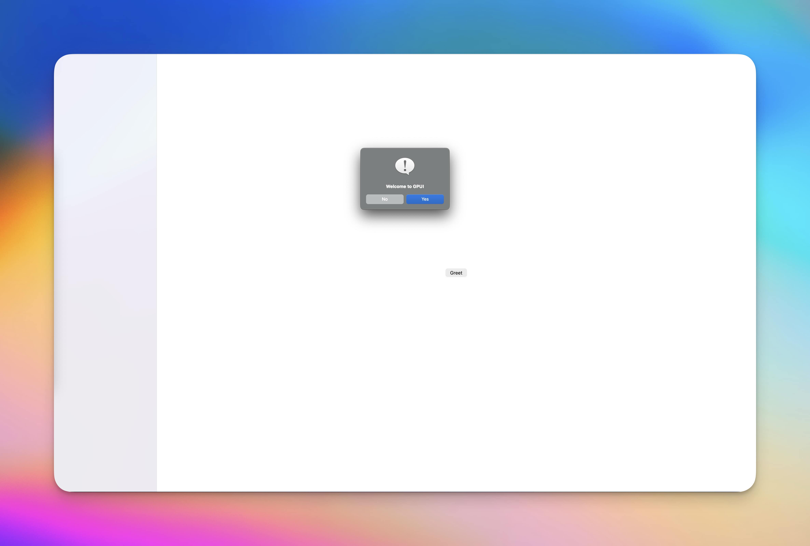

# GPUI
Cross platform desktop app using [gpui](https://www.gpui.rs/) & [gpui-components](https://github.com/longbridge/gpui-component#)

<div align="center">
    
</div>

### Building:
Start the app in dev mode:
```
make watch
```

Run the app is release mode:
```
make build
```